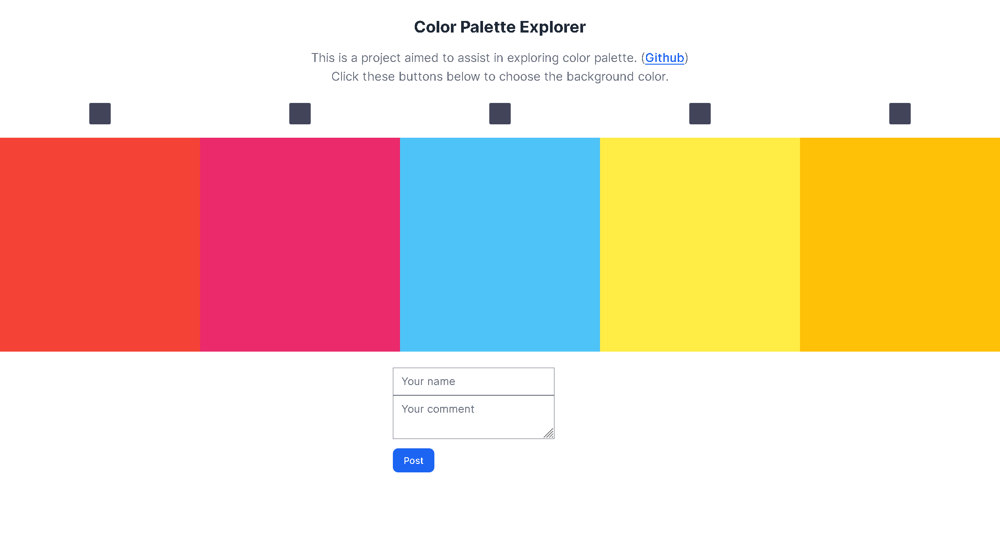
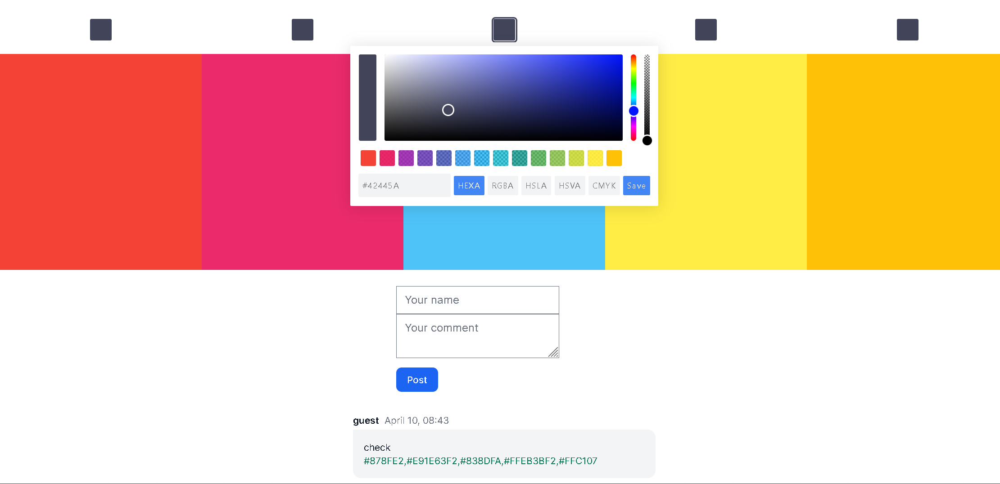

# Color Palette Explorer

## Demonstration:





## Tech used:

PHP & XAMPP  
MariaDB  
Color palette: [Pickr](https://github.com/simonwep/pickr/tree/master)  
Frontend: Tailwind ([Flowbite](https://flowbite.com/))

### Installation

```bash

git clone https://github.com/diaskarshal/color-palette-explorer
cd color-palette-explorer

```

-Install XAMPP  
-Move project files to htdocs  
-Import database  
-Configure database connection  
-Run the Project - http://localhost/your-project-folder

:)
